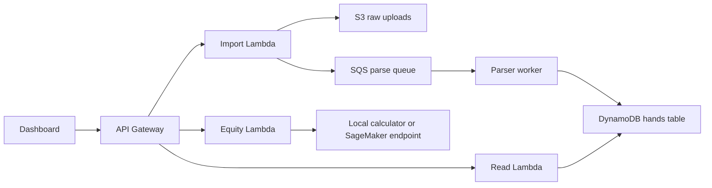

# Architecture Notes

The local app is intentionally small, but the module boundaries line up with a cloud version.

## Local Version

- One Node process serves static files and API routes.
- A JSON file stores imports and parsed hands.
- The parser, stats engine, and equity calculator are plain modules with tests.

## AWS Version

- S3 stores raw hand-history uploads.
- API Gateway fronts the public API.
- Cognito protects user-owned data.
- Lambda handles imports, reads, stats, and equity checks.
- SQS buffers parse jobs so large uploads do not block requests.
- DynamoDB stores parsed hand records keyed by user/session.
- SageMaker can be added later for recommendation or clustering work.

## Data Shape

Raw uploads are kept separate from parsed hands. That makes parser changes easier: old uploads can be reprocessed when the parser learns a new format.

Parsed hands should eventually include:

- `userId`
- `importId`
- `handNumber`
- `tableName`
- `players`
- `hero`
- `holeCards`
- `board`
- `actions`
- `winnings`
- `createdAt`

